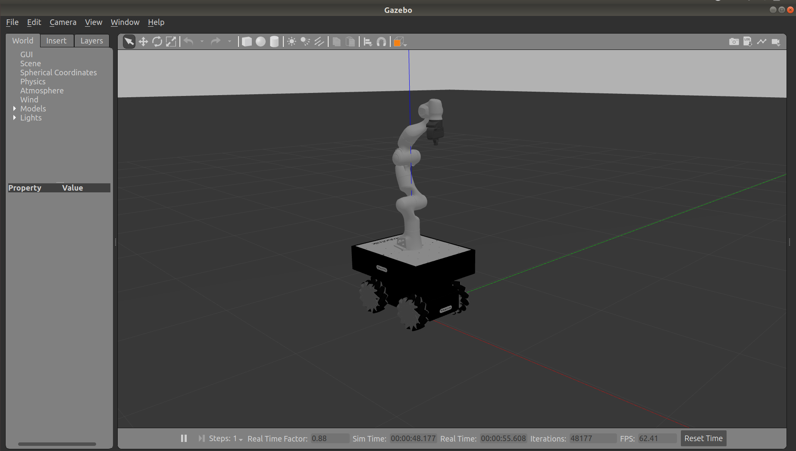
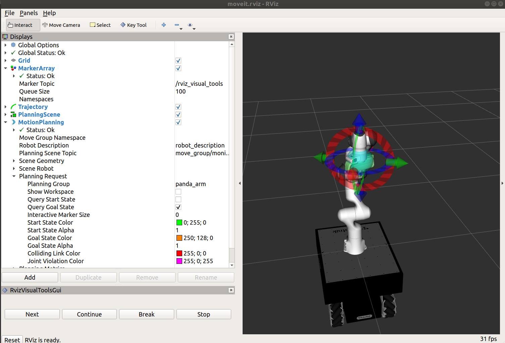
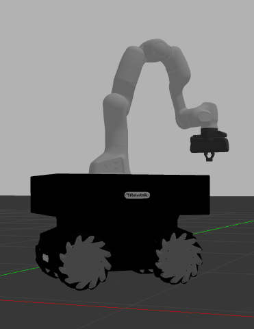

# Alan

*Alan* is a mobile manipulator composted of a
[Summit XL Steel](https://robotnik.eu/products/mobile-robots/summit-xl-steel-en/) base and
a [Franka Panda](https://www.franka.de/) arm.

This project uses the ROS this two packages for simulation:
- https://github.com/erdalpekel/panda_simulation
- https://github.com/RobotnikAutomation/summit_xl_sim

The installation procedure of all the packages required follows.

## Installation
Before downloading the following ROS packages, it is important that you build 
the **libfranka** library from source and pass its directory to *catkin_make* 
when building the ROS packages as described in [this tutorial](https://frankaemika.github.io/docs/installation.html#building-from-source).

```
mkdir -p catkin_ws/src
cd catkin_ws/src

git clone https://github.com/erdalpekel/panda_simulation.git
git clone https://github.com/erdalpekel/panda_moveit_config.git
git clone --branch simulation https://github.com/erdalpekel/franka_ros.git

git clone https://github.com/RobotnikAutomation/summit_xl_common.git
git clone https://github.com/RobotnikAutomation/robotnik_msgs.git
git clone https://github.com/RobotnikAutomation/robotnik_sensors.git
git clone https://github.com/RobotnikAutomation/summit_xl_sim.git

git clone https://github.com/CentroEPiaggio/Alan.git

cd ..
sudo apt-get install libboost-filesystem-dev
rosdep install --from-paths src --ignore-src -y --skip-keys libfranka

catkin_make -DCMAKE_BUILD_TYPE=Release -DFranka_DIR:PATH=/opt/ros/kinetic/lib/libfranka/
```

## Running Alan on Gazebo

```
source devel/setup.bash
roslaunch alan sim.launch
```



## Example Tasks

### 1 - Grasping Task
Launch Gazebo by running:
```
source devel/setup.bash
roslaunch alan sim.launch
```

In a separate terminal run:
```
roslaunch alan ee_pose_control.launch ee_x:=1.0 ee_y:=1.0 ee_z:=0.7
```

where [`ee_x`, `ee_y`, `ee_z`] is the desired end-effector position.


